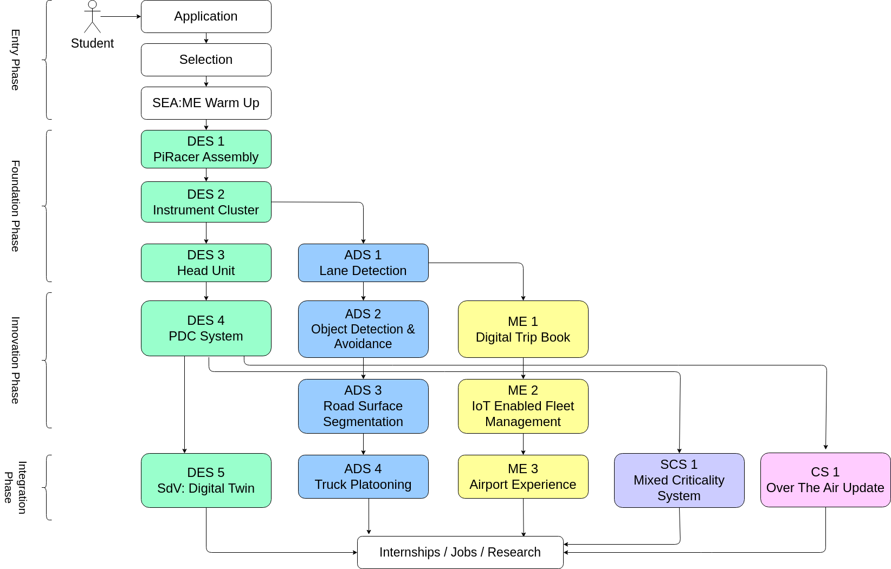

# SEA:ME Study Roadmap
The SEA:ME program is structured as a flexible, project-based learning experience that is designed to be completed within a 12-month period. Once enrolled, students have access to a variety of resources, including collaborative projects and peer learning sessions.

The program is divided into four phases:

1. **Entry Phase**: The phase from application to selection.
2. **Foundation Phase**: During the first two months of the program, students will complete a series of projects in software engineering and mobility technology. These projects are designed to provide a foundation for the rest of the program. The first two weeks will be a full-time introduction to the peer-learning model - where students learn how working with each other can be done and how they can use it for quick learning success. 
3. **Innovation Phase**: In the following six months, students will work on a variety of collaborative projects with their peers. Projects will be focused on real-world problems in the automotive and mobility industry and will involve working with partners from industry and mobility application areas.
4. **Integration Phase**: In the final four months of the program, students will work on integrating their learnings and showcasing their work through a final project that demonstrates their skills and knowledge. This project will be presented to partners and potential employers.

For more information, have a look at 
